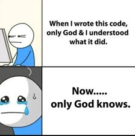

## ESLint

ESLint is an open source project that helps you find and fix problems in your code. Namely, ESLint solves syntax errors that cause your code to be less readable. From my experience with ESLint, fixing syntax errors can be quite frustrating and feel like a waste of time, but this all comes with a great positive. This is seen in the uniformity of code after successfully fixing all syntax errors. Although code readability seems unnecessary for small projects, for shared work or work that is done over a span of time, the ability for code to be read and understood is very important. 

## Code Readability

Code readability helps any person reading code understand what task the code does and how it completes said task. This is completed through syntax, naming, and comments. Syntax such as spacing can allow one to see how code flows, especially in situations that require several brackets (like with if statements, for or while loops, or functions). Naming variables requires proper capitalization and names related to what is being defined. This helps the reader understand what each variable does upon first glance. Comments are likely the most important part of code readability because it tells you exactly what your code does. This helps others reading your code and also yourself as in case you forget what you have coded.

## Overview

Overall, writing readable code is extremely important as it helps one build upon already written code without hours spent deciphering. ESLint is a great example of an application that helps force readability in some ways for your code. It, however, is just one example of the various applications and ways you can use to improve your code for yourself and others.
