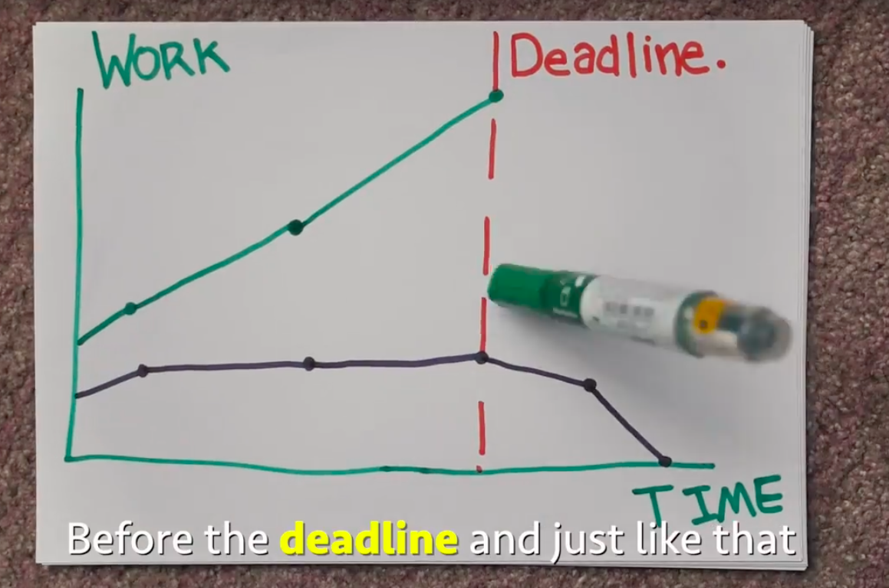

## The Use of Effort Tracking Tools

Effort tracking tools are highly useful in my opinion. This is because effort tracking tools show how much work each individual is putting into their work and the project. In my final project, the main way effort was tracked was through issues completed and time put into work. This was mainly done through simple time tracking on the part of each team member. Most often, I simply took a start and end time for each issue and wrote it as my time.
​
## Final project effort estimation

On my final project for Software Engineering, I made effort estimations for each issue of the project in addition to simply tracking time spent on them. These estimations were founded upon the basis of previous estimations, like for WODs (Works of the day done in the class), and previous experience with coding on personal projects. Through this, I estimated most issues to be around one to two hours. ​

This estimation of time helped bring focus when working on issues. For example, by estimating the time I would take, I had already set myself a goal to work towards. If it did not seem likely that I would complete the task in the given timeframe, I would take a step back and see if I had taken a wrong approach to the issue. This allowed me to stay focused on completing the actual goal instead of possibly finding myself stuck in creating unnecessary and tedious tasks. ​

## Takeaways

In the end, I found that estimations and tracking time were both extremely helpful for keeping oneself on track and guided throughout the project. If I had any changes I could have made before starting this project, I would have started with tracking my time and estimations in a way that made them easier to view. This is because the current method we had undertaken was through comments on each issue on GitHub. This worked for small amounts of issues, but quickly grew into a large problem when one wanted to see the overall patterns of the data. With each estimate and timeframe on each issue, it would require us to click on each issue individually to view the times. In hindsight, the better tool, instead of commenting, would have been using a spreadsheet to list each issue. Overall, I found our methods worked well enough with our project’s scope, but could have had some improvements.
