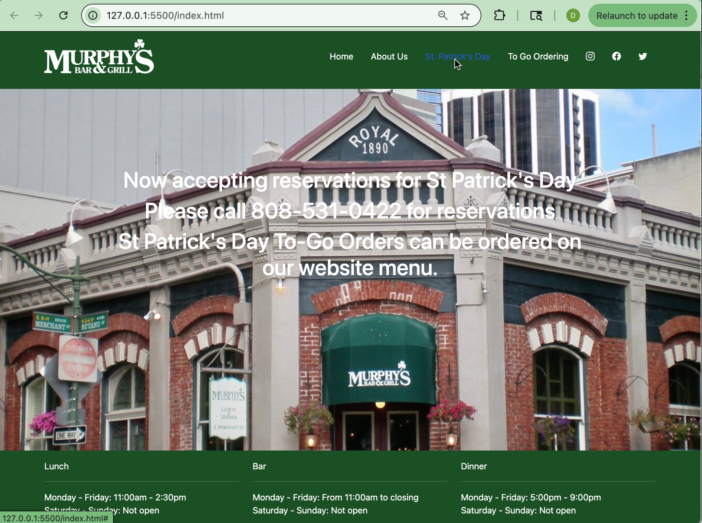

## UI Frameworks

UI is a very important part of app development. It holds what you are showing the user and is used to help the user use the application most efficiently. Despite its usefulness, UI development is an incredibly tedious task. That is why there are UI Frameworks that help improve html and css to make UI development easier. This allows for a quicker and simpler way to develop an application into what you want to create. 

## Bootstrap 5

I have been using Bootstrap 5 as a UI Framework. Through it, I have found implementing parts of a website have become much simpler in certain ways. Bootstrap 5 allows you to use a set of default classes that have their own default styles. This makes it much easier to create, since you can start from prebuilt tools, then customize from there. This allows you to skip a major part of website development.

Although UI Framework can create sites using different tools, the product it creates can still be the same as one not implementing UI Framework. This means that UI Framework does not affect the final product of web design, but simply makes it easier to get to this final product. This can be seen in the example under, which displays a website made with and without Bootstrap 5.

without Bootstrap 5

with Bootstrap 5

## Takeaways

Using any UI Framework allows one to code the same UI, but faster. This is why they are beneficial to learn, despite the fact that its extra content. Using UI Frameworks will make your code in html and css faster, cleaner, and more understandable
