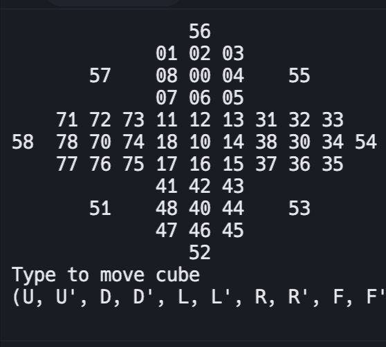

<div class="text-center p-4">
  
</div>

This project was done recreationally by me during my high school junior year. I wanted to practice coding and was drawn to the idea of coding a Rubix cube that could be turned via Rubix cube notation. From the sites I found, I couldn't find any that allowed you to turn a Rubix Cube via text input. This was frustrating due to the difficulty of turning a Rubix Cube via mouse on a 3d simulated cube. Based on this, I decided to code one via Python on Replit, a free coding platform.

This project uses 6 arrays of 9 digits to store each side of the Rubix Cube. Each square on the Rubix Cube is labeled from 0-5 in the tens place for the color and 0-8 for the position on the side of the cube. In order to display all sides at the same time, I decided to use a flatened cube layout with the back of the cube displayed on each of the 8 cardinal directions (N, NW, W, SW, etc.). Turning is based on Rubix Cube notation with U, D, L, R, F, B for Up, Down, Left, Right, Front, Back and ' used for counterclockwise turning. 

From this project, I was able to further my experience in inputs and array handling; Through moving the cube, an input was required. This required input handling and checking to ensure the right inputs were read. Arrays were also the most important part in getting the Rubix Cube to work. Each turn of the Rubix Cube required a certain switch between array values, which was valuable to my experience with arrays.

Here is an example of the text display:

```
                56
             01 02 03
       57    08 00 04    55
             07 06 05
    71 72 73 11 12 13 31 32 33
58  78 70 74 18 10 14 38 30 34 54
    77 76 75 17 16 15 37 36 35
             41 42 43
       51    48 40 44    53
             47 46 45
                52
Type to move cube
(U, U', D, D', L, L', R, R', F, F', B, B')U
                56
             07 08 01
       57    06 00 02    55
             05 04 03
    11 12 13 31 32 33 51 52 53
58  78 70 74 18 10 14 38 30 34 54
    77 76 75 17 16 15 37 36 35
             41 42 43
       71    48 40 44    73
             47 46 45
                72
Type to move cube
(U, U', D, D', L, L', R, R', F, F', B, B')
```

You can find the project here: [https://replit.com/@JacobHatanaka/Rubkix](url).
