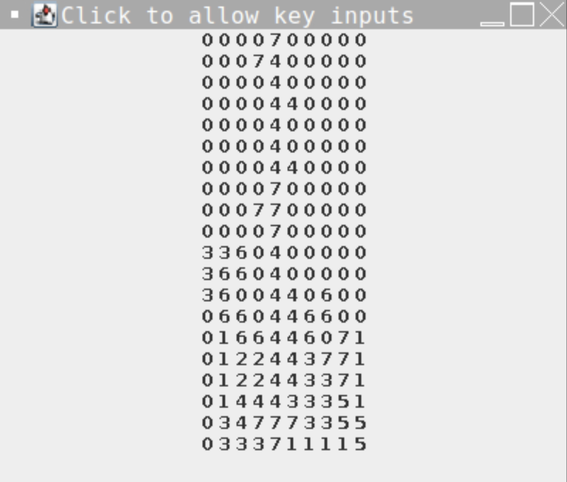

  

This project was done for AP Computer Science during my senior year in high school. The game is displayed on a JFrame interface using Java Swing. It uses digits to display the Tetris board, with 0's representing empty space, and numbers 1-7 representing pieces. It proceeds like a normal Tetris game via WASD controls, with space and down arrow for quick drop and slow drop, respectively.

The game works by using a custom Game class which initializes the Tetris pieces via a custom Piece class. Pieces have a place function which places the piece onto the Tetris board. The board is displayed on JFrame in order to use the KeyListener function of Java Swing. The KeyListener allows for key inputs from the keyboard, rather than taking an input from console.

You can find the project here: [https://replit.com/@JacobHatanaka/End-Year-project-Tetris?v=1](url).
