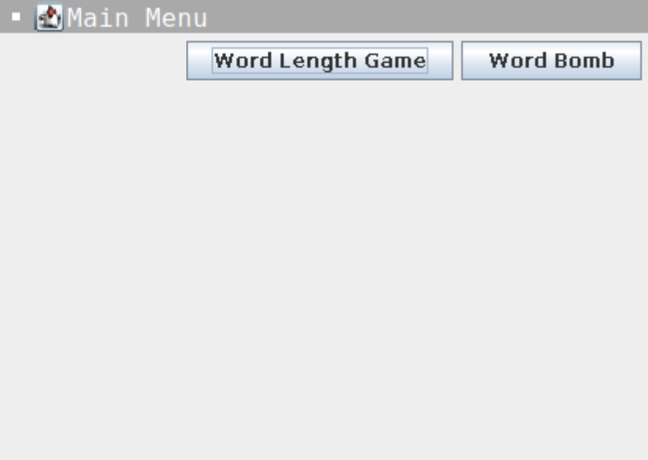
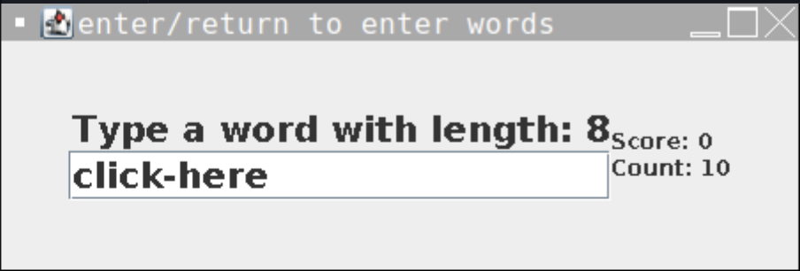
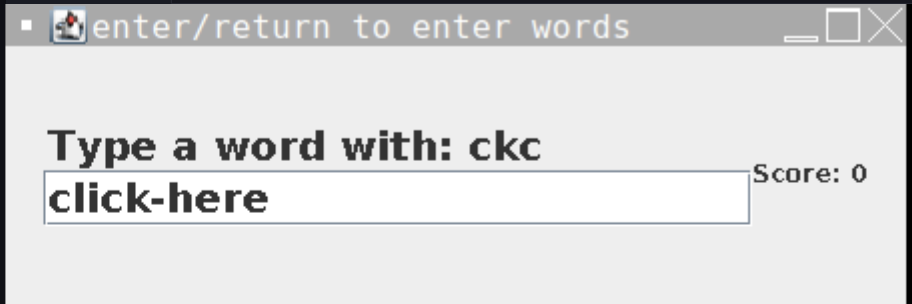

  
  
  

This project was done by me recreationally during my senior year of high school. It includes two word games, a word length game and wordbomb. The world length game requires the user to input a word of the required length, without allowing repetition. Correct answers add to a score display and incorrect or already chosen answers stop the game. This is similar to the wordbomb game, which displays a random assortment of 3 letters, requiring the user to input a word with that three letter phrase contained in the word. For example, the phrase "nde" can be completed with the word "understood."

This project was completed in Java using Java Swing for the User Interface. This includes a main page, which allows you to choose between the two games, and each game. The words are checked from a word list created by dwyl on github. 

You can find the project here: [https://replit.com/@JacobHatanaka/Word-Typing-3?v=1](url).
