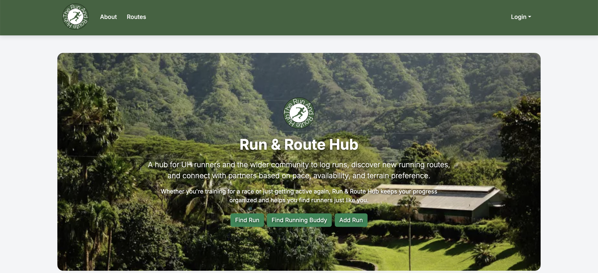

  

## Run & Route Hub

Run & Route Hub is a project developed for my final project in my Software Engineering class at UH Manoa. Run & Route Hub works to allow users to find routes in which they can run and track with the site. It also allows users to create routes and delete routes if necessary. This project took place a little over a month and consisted of 5 team members including myself. 

## Contributions

In terms of this project, I contributed to making and helping with the database and the manipulation of routes. This included adding and removing routes from the database. I also helped with overall design of the website with certain features related to routes. This helped me with my understanding of Prisma and how to manipulate it with code.

## What I Learned

I learned from this project how to manipulate databases and furthered my React and Typescript. This was from my making of the running route Prisma model. This helped me familiarize myself from concepts we learned throughout the course of Software Engineering. In addition to database modifications, I learned React, a form of Javascript which simplifies web design, by creating pages used to add and delete routes. This helped me create a UI much easier than if I had not used it. By continually modifying the project, I learned how to manipulate Typescript and craft the interface.

[run-and-route-hub.github.io/](https://run-and-route-hub.github.io/)
